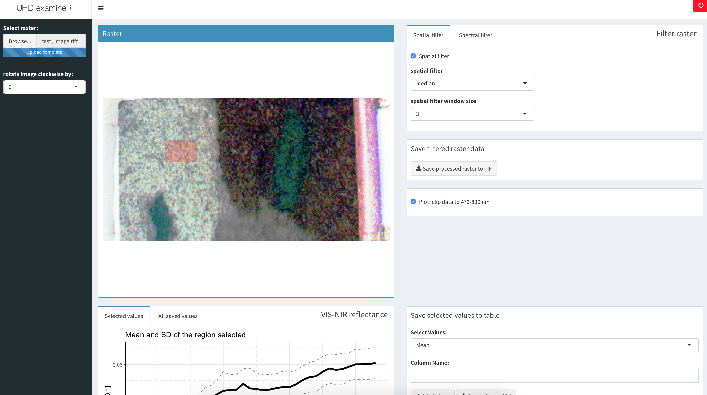

# UHD examineR
examine hyperspectral recordings from an UHD258 device

# v.1.0.1 - README

---------------------
### Description:

Load and inspect hyperspectral recordings captured with a 
Cubert UHD258 snapshot camera. The imported raster file is 
plotted as RGB image. The raster can be manipulated
(spatial and spectral filters). By selecting an area of 
interest in the plotted raster, a plot of the mean spectrum
is generated (+/- sd). The selected spectrum can be saved
to a `data.frame`, which can be exported as CSV file. The
manipulated raster can be saved to a TIF file.

---------------------
### Usage:

+ install required packages
+ run app via `shiny::runApp()`
+ import hyperspectral raster stack (e.g. 'test_image.tif')
+ interactively examine the spectral data
+ optionally apply spatial and spectral filters
+ export selected spectra or the processed raster data

---------------------
### Required packages & References:

**shiny:**
Winston Chang, Joe Cheng, JJ Allaire, Yihui Xie and Jonathan
 McPherson (2018). shiny: Web Application Framework for R. R
 package version 1.1.0. https://CRAN.R-project.org/package=shiny

**shinydashboard:**
Winston Chang and Barbara Borges Ribeiro (2018). shinydashboard:
 Create Dashboards with 'Shiny'. R package version 0.7.1.
 https://CRAN.R-project.org/package=shinydashboard

**shinyjs:**
Dean Attali (2018). shinyjs: Easily Improve the User Experience
 of Your Shiny Apps in Seconds. R package version 1.0.
 https://CRAN.R-project.org/package=shinyjs

**shinyWidgets:**
Victor Perrier, Fanny Meyer and David Granjon (2019).
 shinyWidgets: Custom Inputs Widgets for Shiny. R package version
 0.4.8. https://CRAN.R-project.org/package=shinyWidgets

**DT:**
Yihui Xie, Joe Cheng and Xianying Tan (2019). DT: A Wrapper of
 the JavaScript Library 'DataTables'. R package version 0.6.
 https://CRAN.R-project.org/package=DT

**raster:**
Robert J. Hijmans (2019). raster: Geographic Data Analysis and
 Modeling. R package version 2.9-23.
 https://CRAN.R-project.org/package=raster

**velox:**
Philipp Hunziker (2018). velox: Fast Raster Manipulation and
 Extraction. R package version 0.2.0.9002.

**ggplot2:**
H. Wickham. ggplot2: Elegant Graphics for Data Analysis.
 Springer-Verlag New York, 2016.

**hsdar:**
Lukas W. Lehnert, Hanna Meyer, Joerg Bendix (2018). hsdar:
 Manage, analyse and simulate hyperspectral data in R. R package
 version 0.7.1.
 
---------------------
### MIT License
